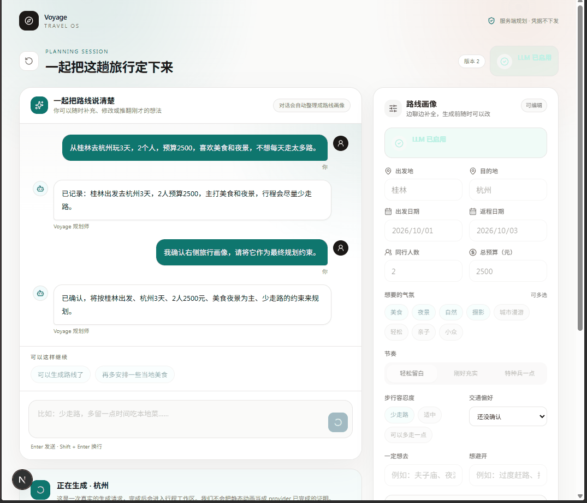
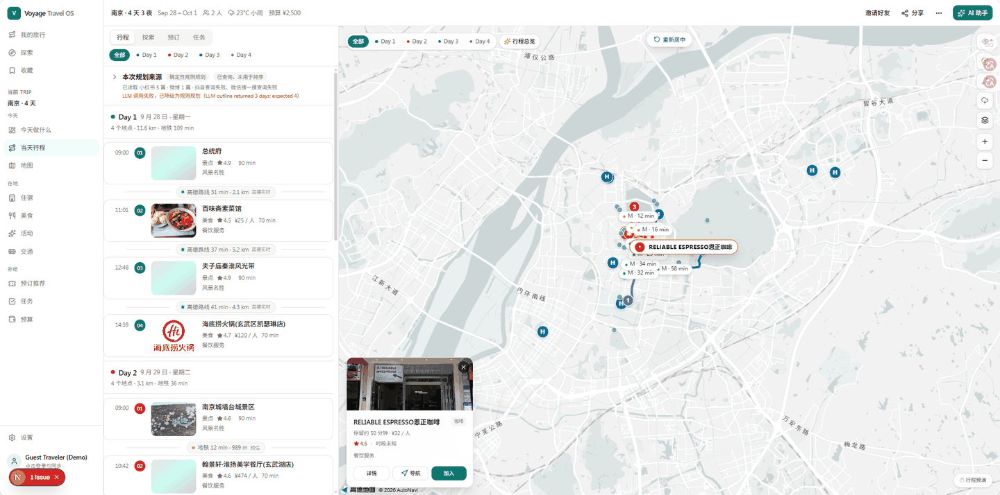
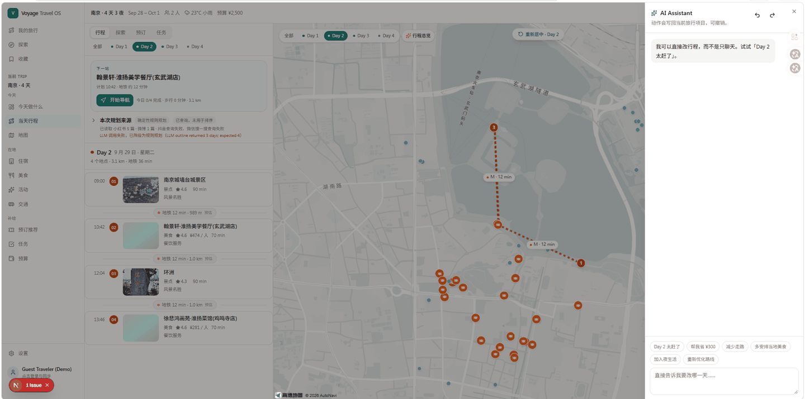
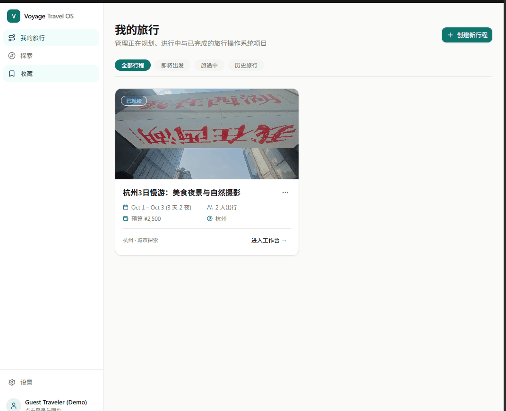
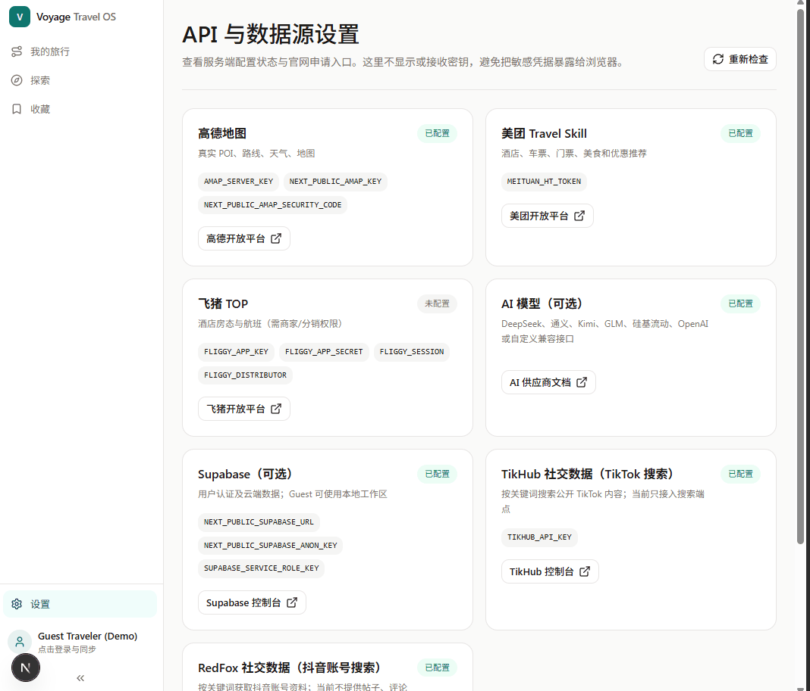

# Voyage · Travel OS

> **Voyage is an AI-native Travel OS.**  
> 不是攻略生成器，不是长篇 Markdown 机器，也不是臃肿的 OTA 销售平台。  
> 它的使命是：**让一个真实的人，真的敢拿 Voyage 去完成一次旅行。**

用户输入一句简单愿望：
> “从桂林去重庆玩 3 天，2 个人，预算 2500，喜欢美食和夜景，不想每天走太多路。”

Voyage 在几秒钟内生成一个**真实的、结构化的、带高德坐标与路网、受天气感知、可持久化、随时可修改的完整旅行项目**。

用户旅途中只需说：
- “明天太累了” → 减少长距离攀爬，步行自动转打车与轻轨；
- “今天下雨了” → 触发 Rain Plan，露天步道平滑置换为室内三峡博物馆；
- “今天省 100 块” → 打车智能回退为地铁，餐饮结构微调；
- “推迟一小时” → 节点整体顺延，重新校准各段交通；

每一个自然语言指令，都会被编译成经过 Zod 校验的结构化 `TravelAction`，生成量化对比报告（`TripChangeSet`）呈现在 Diff 审阅弹窗中，待用户确认后才应用。

---

## 界面预览

先和 Agent 把需求聊清楚，确认后再生成真实路线；生成之后仍然可以在行程里继续调整。

### 1. 对话式规划 · 边聊边形成旅行画像



### 2. 行程工作区 · 看哪一天就只显示哪一天

左侧只显示选中当天的行程，右侧地图只画当天的标记与路线；每条路线标注来源（高德实时 / 估算）。



### 3. 当天行程 + AI 助手 · 旅途中直接改

顶部直接给出「下一站」与一键导航，不需要自己解读整屏信息；右侧助手可以按天改行程，且只生成提案，需在 Diff 里确认才会写回。



### 4. 我的旅行 · 所有行程项目



### 5. 数据源设置 · 密钥只在服务端

只显示每项能力「是否已配置」，不显示也不接收密钥值，避免凭据暴露到浏览器。



---

## 核心四大阶段 (Four Pillars)

| 阶段 | 职责定位 | 核心能力 |
|---|---|---|
| **1. Plan** | 行程规划与时间轴生成 | 目的地真实 POI 聚合，按地理就近聚类，自动排布正餐、游览时长与预算分布。 |
| **2. Explore** | 真实探索与商户发现 | 实时高德 POI 检索，支持“室内、夜景、免费、少走路”等精准标签筛选，杜绝伪造评分与空头价格。 |
| **3. Adapt** | 动态适应与差异审阅 | 全局 Command Bar (`Cmd+K`) 随时唤起，修改前量化展示步行减量、交通置换与费用差值，支持 10 步随时 Undo。 |
| **4. Travel** | 现场执行控制台 (Today) | 移动端优先单手操作：实时锁定下一站目标、出发与到达倒计时、直连高德 App 真实导航。 |

---

## 技术架构

```
UI Components (Next.js 15 App Router · React 19 · Tailwind v4 · Radix UI · Motion · dnd-kit)
      ↓
State & Control Layer (Zustand: useTripStore · useUiStore · useHistoryStore · CommandBar)
      ↓
AI Action & Diff Engine (TravelAction 3.0 · ActionPlanner · ActionExecutor · TripDiffModal)
      ↓
Travel Intelligence (Route Matrix · Transport Scoring · RAG Planning Context)
      ↓
Knowledge Engine (Hybrid Keyword + pgvector · Freshness · Confidence · Provenance)
      ↓
Service Facades & Routing Engine (RoutingService · WeatherContext · BookingIntent)
      ↓
Server Boundary (API Routes with 'server-only' secrets isolation)
  ├── AMap REST (POI Search, Geocoding, Walking/Driving/Transit Directions, Polylines)
  ├── OpenAI-compatible LLM (Chat Completions: Qwen, DeepSeek, GPT-4o)
  └── Supabase (Secure RLS bound to auth.uid() + In-Memory Fallback)
```

---

## 快速启动

```bash
cd voyage
npm install
npm run dev
```

浏览器打开 [http://localhost:3002](http://localhost:3002)

### 验证命令
```bash
npm run lint         # ESLint 代码规范检查 (0 errors, 0 warnings)
npm run typecheck    # TypeScript 严格类型检查 (0 errors)
npm test             # Vitest 单元与集成测试 (23 tests passed)
npm run build        # 生产环境 Turbopack 打包编译
npm run test:e2e     # Playwright 端到端 Golden Trip 自动化验证
```

---

## 环境变量配置 (`.env.local`)

| 环境变量 | 说明 | 缺省行为 |
|---|---|---|
| `NEXT_PUBLIC_AMAP_KEY` | 高德 JS API Key (Web 客户端) | 未配置时自动降级为 SVG 矢量投影底图 |
| `NEXT_PUBLIC_AMAP_SECURITY_CODE` | 高德 JS API 安全密钥 | 配合 JS Key 使用 |
| `AMAP_SERVER_KEY` | 高德 Web 服务服务端 REST Key | 未配置时走精选真实地点库与 Haversine 估算 |
| `LLM_BASE_URL` | OpenAI 兼容的大模型 API 根地址 (如方舟/DeepSeek) | 未配置时自动切入规则引擎 |
| `LLM_API_KEY` | 服务端模型 API Key | 保护在服务端，绝不向浏览器泄露 |
| `LLM_MODEL` | 模型名称 (如 `deepseek-v3`, `gpt-4o-mini`) | 默认 `gpt-4o-mini` |
| `EMBEDDING_BASE_URL` | OpenAI-compatible Embeddings API 根地址 | 未配置时 RAG 自动降级为关键词/本地知识检索 |
| `EMBEDDING_API_KEY` | Embedding API Key | 仅服务端使用 |
| `EMBEDDING_MODEL` | 1536 维 Embedding 模型 | 未配置时不执行语义向量检索 |
| `NEXT_PUBLIC_SUPABASE_URL` | Supabase 项目地址 | 未配置时自动无感运行在内存 Demo 模式 |
| `NEXT_PUBLIC_SUPABASE_ANON_KEY` | Supabase 客户端匿名密钥 | 严格受 `0002_rls_secure.sql` 行级安全控制 |

---

## 文档索引

- [`docs/GOLDEN_TRIP.md`](docs/GOLDEN_TRIP.md) — 桂林 ↔ 重庆 3天2夜 核心黄金验收基准
- [`docs/PHASE3_AUDIT.md`](docs/PHASE3_AUDIT.md) — 深度代码库 15 维度审计报告
- [`docs/PHASE3_IMPLEMENTATION_PLAN.md`](docs/PHASE3_IMPLEMENTATION_PLAN.md) — Phase 3 详细执行计划
- [`docs/REAL_WORLD_PROVIDER_GUIDE.md`](docs/REAL_WORLD_PROVIDER_GUIDE.md) — 高德/天气/预订/Supabase 接入指南
- [`docs/TRAVEL_ACTIONS.md`](docs/TRAVEL_ACTIONS.md) — 24 项 TravelAction 规格与 Diff 预览说明
- [`docs/BETA_ACCEPTANCE.md`](docs/BETA_ACCEPTANCE.md) — 18 项 Beta 用户路径通关报告
- [`knowledge/README.md`](knowledge/README.md) — Travel Knowledge RAG 数据格式、入库与检索说明

---

## 联系作者

使用中遇到问题、想提建议、或者想聊聊这个项目，欢迎直接加微信：


> 也可以在 GitHub Issues 里留言。微信个人二维码会定期更换，若扫码失效请先提 Issue。
